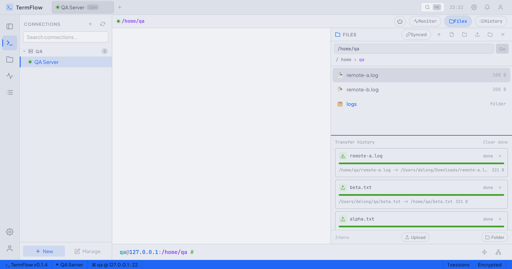

# Portline / TermFlow

Portline is a Wails desktop SSH workspace built with Go, React, Vite, and xterm.js. The Go module is still named `termflow`; the packaged desktop app is named `Portline` in `wails.json`.

It provides a local desktop interface for saving SSH connections, opening terminal sessions, running saved commands, browsing local and remote files, transferring files over SFTP, and checking a remote host monitor snapshot.



## Features

- SSH connection manager with groups, tags, password auth, private key auth, and development-only host-key bypass.
- Multi-session terminal workspace powered by xterm.js.
- Command history and saved commands, including broadcast command execution across open sessions.
- Local and remote file browser with create, edit, rename, delete, upload, and download flows.
- SFTP file and folder transfer with overwrite protection.
- Remote monitor view for CPU, memory, disk, load average, and top processes.
- App settings for theme, accent color, terminal font size, copy behavior, SSH key path, and known hosts path.
- SQLite-backed local storage for connections, command history, saved commands, and settings.

## Tech Stack

- Desktop shell: [Wails v2](https://wails.io/)
- Backend: Go
- Frontend: React 18, TypeScript, Vite
- Terminal: `@xterm/xterm` and `@xterm/addon-fit`
- SSH and SFTP: `golang.org/x/crypto/ssh` and `github.com/pkg/sftp`
- Storage: SQLite through `modernc.org/sqlite`

## Requirements

- Go 1.25 or newer, matching `go.mod`.
- Node.js and npm for the Vite frontend.
- Wails CLI v2 for desktop development and packaging.
- A working SSH target for real terminal testing.

Install Wails if it is not already available:

```bash
go install github.com/wailsapp/wails/v2/cmd/wails@latest
```

Install frontend dependencies:

```bash
cd frontend
npm install
```

## Quick Start

Run the full desktop app in development mode:

```bash
wails dev
```

Run only the frontend dev server:

```bash
cd frontend
npm run dev
```

Build the frontend:

```bash
cd frontend
npm run build
```

Build the packaged desktop app:

```bash
wails build
```

## Test and Verification

Run the Go test suite:

```bash
go test ./...
```

Verify backend packages compile:

```bash
go build ./...
```

Build the frontend:

```bash
cd frontend
npm run build
```

There is currently no dedicated frontend test script. For visible UI changes, validate with the Vite or Wails dev server and capture screenshots of the affected workflow.

## Project Structure

```text
.
├── app.go                         # Wails-bound application API
├── main.go                        # Wails app entry point and desktop options
├── internal/
│   ├── appsvc/                    # Application service layer
│   ├── domain/                    # Shared domain models and event names
│   ├── sessions/                  # Active SSH session registry
│   ├── sshclient/                 # SSH, terminal, SFTP, and key handling
│   └── storage/                   # SQLite persistence
├── frontend/
│   ├── src/app/                   # Main React application shell
│   ├── src/features/              # Terminal, sessions, status, connections
│   ├── src/shared/api/            # Typed Wails API wrapper
│   └── wailsjs/                   # Generated Wails bindings
├── docs/                          # Product specs and implementation plans
├── ux/                            # Design prototypes and screenshots
└── wails.json                     # Wails project configuration
```

Do not manually edit `frontend/wailsjs`; regenerate it through Wails when backend bindings change.

## Runtime Data

The app stores its SQLite database at:

```text
<user-config-dir>/TermFlow/termflow.db
```

If `os.UserConfigDir()` is unavailable, it falls back to:

```text
~/.config/TermFlow/termflow.db
```

The database includes saved connections, command history, saved commands, and app settings.

## SSH Notes

Password and private key authentication are implemented. Private key auth supports OpenSSH keys and unencrypted RSA PuTTY `.ppk` keys. Encrypted PuTTY private keys should be converted to OpenSSH format first.

SSH agent auth is present in the UI/settings model, but the backend currently returns:

```text
ssh agent auth is not implemented in MVP
```

Host key verification uses `~/.ssh/known_hosts` by default. For development-only connections, a connection can set `InsecureIgnoreHostKey`, but production connections should use a real `known_hosts` entry.

## Backend API Surface

`app.go` exposes the Wails methods used by the frontend:

- Connections: `ListConnections`, `SaveConnection`, `DeleteConnection`, `TestConnection`
- Sessions and terminal I/O: `OpenSession`, `CloseSession`, `WriteTerminal`, `ResizeTerminal`
- Commands: `RunCommand`, `RecordCommandHistory`, `ListCommandHistory`, `ClearCommandHistory`
- Saved commands: `ListSavedCommands`, `SaveSavedCommand`, `DeleteSavedCommand`
- Settings: `GetSettings`, `SaveSettings`
- Files and transfer: `ListFiles`, `ReadFile`, `SaveFile`, `CreateFolder`, `RenameFile`, `DeleteFile`, `TransferFile`
- Native dialogs: `SelectLocalFile`, `SelectLocalFiles`, `SelectLocalDirectory`, `SelectSaveFile`
- Monitoring: `GetMonitorSnapshot`

Wails events emitted by the backend include `session:created`, `session:output`, `session:status`, `session:error`, and `session:closed`.

## Development Guidelines

- Format Go code with `gofmt`.
- Keep backend package names short and lowercase.
- Keep React components PascalCase and TypeScript helpers camelCase.
- Add or update Go tests next to the changed package.
- Run `go test ./...` before submitting backend changes.
- Run `cd frontend && npm run build` before submitting frontend changes.
- Keep generated files and build artifacts out of manual edits unless the task explicitly requires them.

## Troubleshooting

If `wails dev` cannot find frontend dependencies, run:

```bash
cd frontend
npm install
```

If an SSH connection fails with a `known_hosts` message, add the host key to `~/.ssh/known_hosts`:

```bash
ssh-keyscan -H example.com >> ~/.ssh/known_hosts
```

If private key auth fails for a PuTTY key, convert it to OpenSSH format with PuTTYgen and retry using the converted key path.

If a remote file cannot be edited, check whether it is a folder, binary file, or larger than the current editable file limit of 2 MB.
